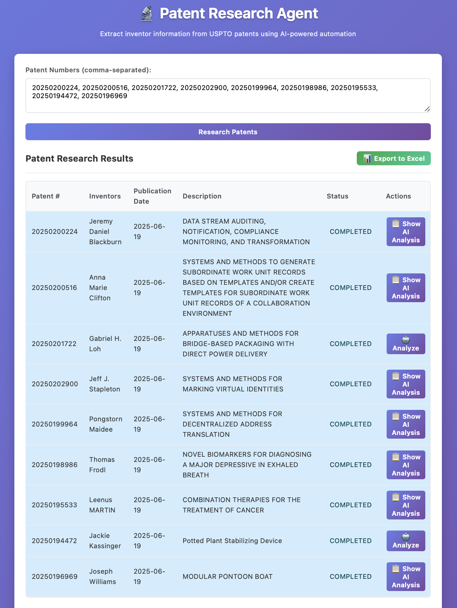
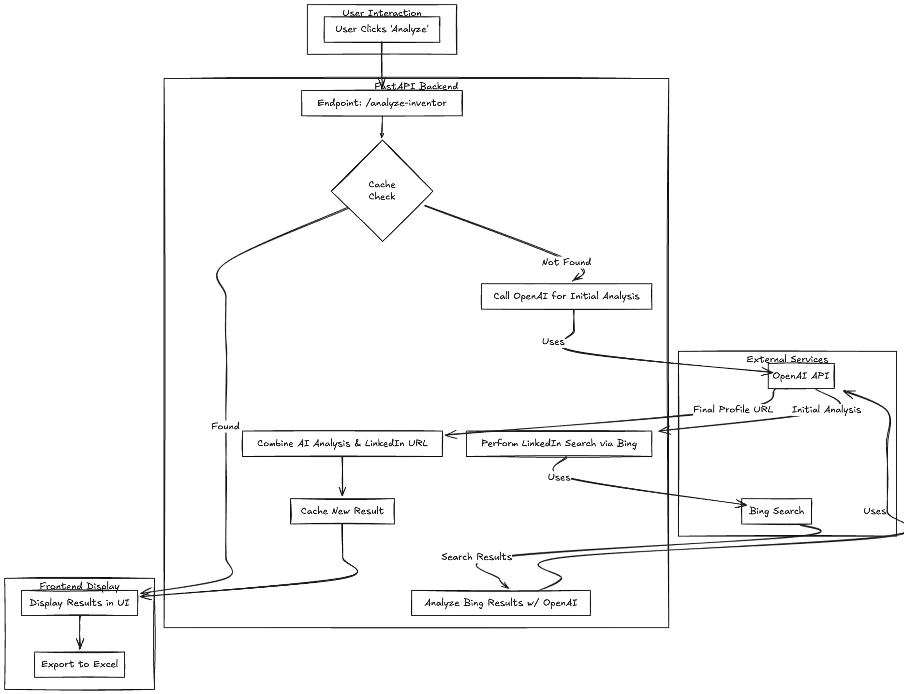

# Patent Research Agent

This project is an AI-powered web application designed to streamline the process of patent research. It allows users to query patent numbers, scrapes data from the USPTO, enriches it with AI-driven contact analysis, and discovers potential LinkedIn profiles for the inventors.



## Core Features

-   **Multi-Patent Processing**: Enter multiple comma-separated patent numbers for batch processing.
-   **Real-time Updates**: The frontend uses Server-Sent Events (SSE) to provide real-time status updates as each patent is processed.
-   **AI-Powered Contact Analysis**: For each inventor, the agent uses an AI model to generate contact-finding strategies, email suggestions, and search terms.
-   **LinkedIn Profile Discovery**: Leverages advanced web scraping with Playwright to find likely LinkedIn profiles for inventors, bypassing common bot detection measures.
-   **Efficient Caching**: Results for both patent data and AI analysis are cached to prevent redundant work and speed up subsequent requests.
-   **Excel Export**: All gathered data, including the detailed AI analysis and LinkedIn profiles, can be exported to a multi-sheet Excel file.

## Architecture

The application is built with a FastAPI backend and a vanilla JavaScript frontend.

```
[System Architecture Diagram - Placeholder]
+-----------------+      +----------------------+      +----------------+
|   Frontend      |----->|   FastAPI Backend    |----->|   USPTO        |
| (JS, HTML, CSS) |      |   (main.py)          |      |   (Scraping)   |
+-----------------+      +----------------------+      +----------------+
                         |                      |
                         |                      |      +----------------+
                         |                      +----->|   OpenAI API   |
                         |                      |      |   (Analysis)   |
                         |                      |      +----------------+
                         |                      |
                         |                      |      +----------------+
                         |                      +----->|   Bing Search  |
                         |                             | (LinkedIn Discovery) |
                         +-----------------------------+----------------+
```

### Components

-   **`main.py`**: The core FastAPI application. It handles all HTTP requests, orchestrates the different services, and manages the application lifecycle.
-   **`static/`**: Contains the frontend code (`index.html`, `script.js`, `style.css`).
-   **`services/`**: A collection of modules responsible for specific tasks:
    -   `patent_service.py`: Handles scraping patent data from the USPTO website using Playwright.
    -   `openai_service.py`: Interfaces with the OpenAI API to perform contact analysis.
    -   `linkedin_playwright_search.py`: Manages the complex process of searching for LinkedIn profiles using Playwright, designed to evade bot detection.
    -   `cache_service.py`: Provides a simple file-based caching mechanism for patent data and AI analysis.

## Setup and Running the Project

1.  **Install Dependencies**:
    ```bash
    pip install -r requirements.txt
    ```

2.  **Install Playwright Browsers**:
    ```bash
    playwright install
    ```

3.  **Set Up Environment Variables**:
    Create a `.env` file in the root directory and add your OpenAI API key:
    ```
    OPENAI_API_KEY="your_openai_api_key_here"
    ```

4.  **Run the Application**:
    ```bash
    cd src
    python main.py
    ```

5.  Open your browser and navigate to `http://127.0.0.1:8888`.

## Technical Highlights & Workflow

The main user flow for AI analysis is robust and designed to handle various real-world challenges.



Diagram in mermaid:
```mermaid
graph TD
    subgraph User Interaction
        A[User Clicks "Analyze"]
    end

    subgraph FastAPI Backend
        B[Endpoint: /analyze-inventor]
        C{Cache Check}
        E[Call OpenAI for Initial Analysis]
        F[Perform LinkedIn Search via Bing]
        F_sub[Analyze Bing Results w/ OpenAI]
        G[Combine AI Analysis & LinkedIn URL]
        H[Cache New Result]
    end

    subgraph External Services
        I[OpenAI API]
        J[Bing Search]
    end
    
    subgraph Frontend Display
        K[Display Results in UI]
        L[Export to Excel]
    end

    A --> B;
    B --> C;
    C -- Found --> K;
    C -- Not Found --> E;
    E -- Uses --> I;
    I -- Initial Analysis --> F;
    F -- Uses --> J;
    J -- Search Results --> F_sub;
    F_sub -- Uses --> I;
    I -- Final Profile URL --> G;
    G --> H;
    H --> K;
    K --> L;
```

This diagram visually represents the step-by-step process from the user's click to the final display of the enriched data, including the caching logic and interactions with external services.
